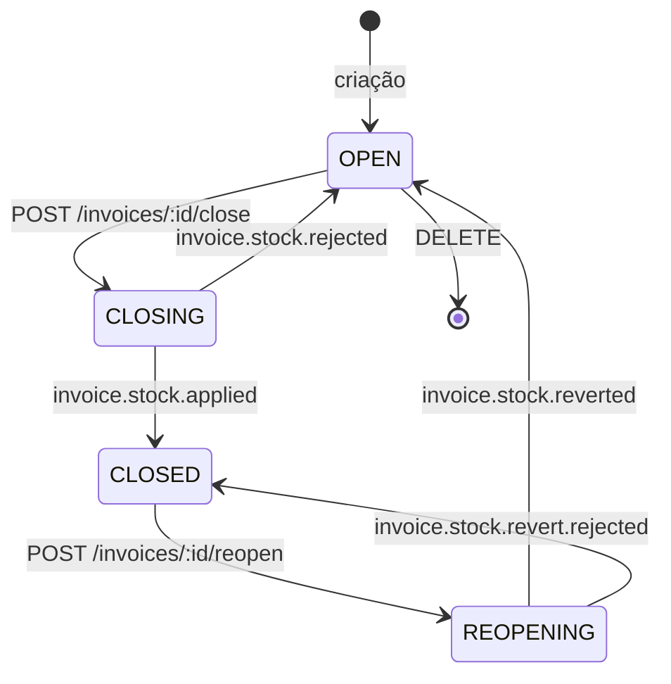
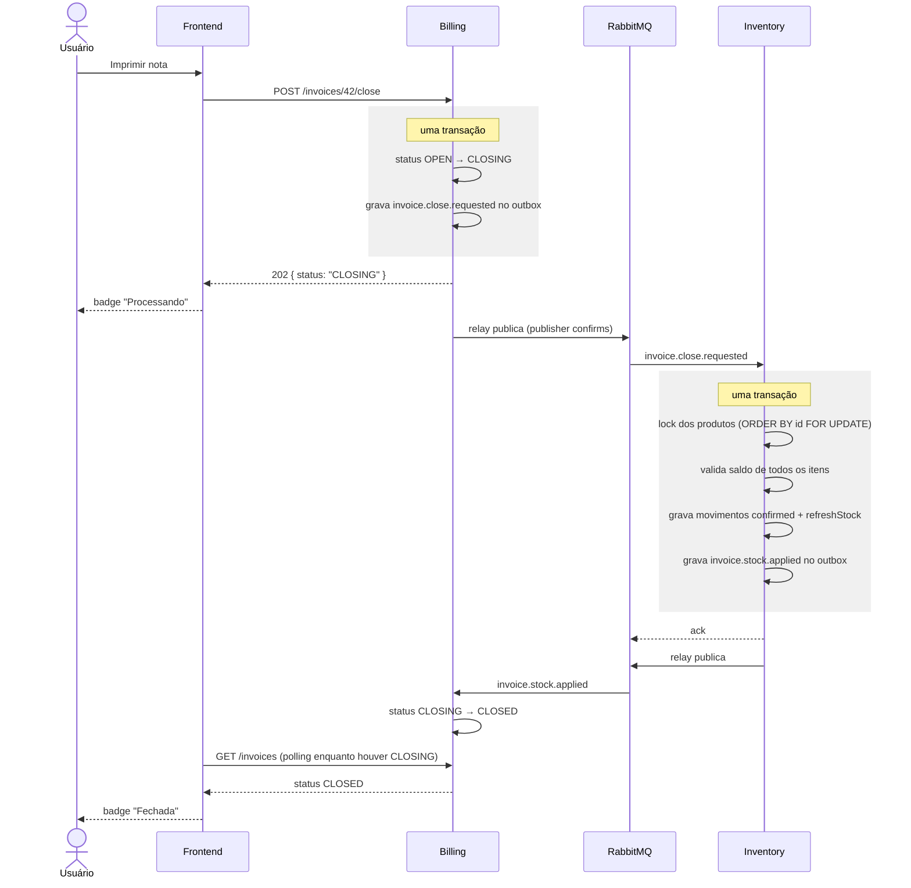
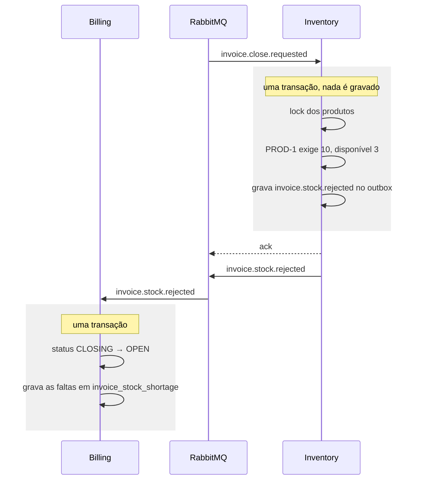

# Arquitetura — integração entre billing e inventory

## Contexto

O sistema tem dois microsserviços, cada um com seu próprio banco Postgres e sem
acesso ao banco do outro:

- **inventory** — catálogo de produtos e razão de movimentações de estoque. O
  campo `product.stock` é saldo cacheado, sempre recalculado a partir dos
  movimentos confirmados.
- **billing** — notas fiscais e seus itens. Mantém uma réplica local de
  `product` para preservar o snapshot do item (código, nome, unidade e preço no
  momento da emissão).

Até aqui os dois serviços não se comunicavam. Este documento descreve a
integração exigida pelo requisito de negócio:

> Ao imprimir/finalizar a nota fiscal, o saldo de estoque do produto deve ser
> atualizado no inventory, garantindo que exista estoque suficiente antes do
> fechamento.

## Decisão: fechamento assíncrono via mensageria

O fechamento envolve dois bancos distintos, então não existe transação única
que cubra os dois lados. As opções avaliadas foram:

| Opção | Por que não |
|---|---|
| Billing escreve direto no banco do inventory | Quebra o isolamento dos serviços; o inventory deixa de ser dono das suas regras |
| Billing consulta o saldo e depois grava o movimento | Duas chamadas separadas abrem janela de corrida (TOCTOU): duas notas concorrentes passam nas duas validações e o saldo fica negativo |
| Chamada HTTP síncrona no request do fechamento | Funciona, mas o fechamento passa a depender do inventory estar no ar naquele instante |
| **Requisição assíncrona coreografada por eventos** | **Escolhida** |

A escolha é assíncrona por dois motivos:

1. **Disponibilidade.** O usuário consegue fechar uma nota com o inventory fora
   do ar. A requisição fica durável na fila e é processada quando o serviço
   volta, sem intervenção manual.
2. **Feedback explícito.** A nota ganha o estado `CLOSING` ("Processando"),
   visível na interface. O assincronismo deixa de ser um efeito colateral
   escondido e passa a ser parte do contrato da tela.

O custo assumido é consistência eventual: existe um intervalo — normalmente de
milissegundos — em que a nota já saiu de `OPEN` mas ainda não está `CLOSED`.
Esse intervalo é representado no modelo, bloqueia edição e exclusão
(*semantic lock*) e é exibido ao usuário.

A validação de saldo **não** acontece no billing. Ela é uma regra do inventory
e roda dentro da mesma transação que grava os movimentos, sob lock das linhas
de produto. Verificar em um serviço e gravar em outro seria a corrida descrita
na tabela acima.

## Ciclo de vida da nota fiscal



| Estado | Rótulo na tela | Editar | Excluir | Fechar | Reabrir |
|---|---|:-:|:-:|:-:|:-:|
| `OPEN` | Aberta | sim | sim | sim | — |
| `CLOSING` | Processando | não | não | não | não |
| `CLOSED` | Fechada | não | não | — | sim |
| `REOPENING` | Processando | não | não | não | não |

Os dois estados de processamento existem para que a reabertura tenha o mesmo
tratamento do fechamento: estornar uma nota de entrada também pode ser recusado
pelo inventory, quando a mercadoria já saiu e o estorno deixaria o saldo
negativo. Um fluxo síncrono e outro assíncrono para a mesma nota produziria
duas máquinas de estado diferentes.

## Fluxo de fechamento — caminho feliz



## Fluxo de compensação — saldo insuficiente



Saldo insuficiente é **resposta de negócio, não falha de infraestrutura**: a
mensagem recebe ack normalmente e não vai para a DLQ. A compensação da saga é
devolver a nota para `OPEN`.

Como não existe request aberto para responder com 409, o motivo da recusa é
persistido e devolvido pela API, para que a interface consiga exibir
"PROD-1: a nota pede 10, disponível 3" quando a nota voltar a ficar aberta.

## Contratos dos eventos

Envelope comum a todos os eventos:

```json
{
  "eventId": "0f6a1c2e-...",
  "occurredAt": "2026-08-21T13:40:00Z",
  "invoiceId": 42
}
```

`eventId` é um UUID gerado na escrita do outbox e permanece o mesmo em todas as
republicações da mesma mensagem — é o que permite auditar reentregas.

### billing → inventory (exchange `billing.events`)

**`invoice.close.requested`**

```json
{
  "eventId": "...",
  "occurredAt": "...",
  "invoiceId": 42,
  "invoiceNumber": "NF-000042",
  "type": "OUT",
  "items": [
    { "invoiceItemId": 108, "productId": 7, "quantity": 10 },
    { "invoiceItemId": 109, "productId": 12, "quantity": 2 }
  ]
}
```

`productId` é o identificador do produto **no inventory**. No banco do billing
ele corresponde a `product.inventory_id`, não a `product.id` — a réplica local
tem chave própria. Confundir os dois é o erro mais provável nessa integração.

**`invoice.reopen.requested`**

```json
{ "eventId": "...", "occurredAt": "...", "invoiceId": 42 }
```

O inventory já conhece os movimentos da nota, então o estorno não precisa
repetir os itens.

### inventory → billing (exchange `inventory.events`)

**`invoice.stock.applied`** e **`invoice.stock.reverted`**

```json
{ "eventId": "...", "occurredAt": "...", "invoiceId": 42 }
```

**`invoice.stock.rejected`** e **`invoice.stock.revert.rejected`**

```json
{
  "eventId": "...",
  "occurredAt": "...",
  "invoiceId": 42,
  "reason": "INSUFFICIENT_STOCK",
  "shortages": [
    { "productId": 7, "code": "PROD-1", "name": "Parafuso", "required": 10, "available": 3 }
  ]
}
```

Outros valores possíveis de `reason`: `PRODUCT_NOT_FOUND`, quando um produto da
nota não existe mais no inventory.

## Topologia RabbitMQ

```
billing.events (topic, durable)
  ├── invoice.close.requested ──┐
  └── invoice.reopen.requested ─┴─→ inventory.invoice-requests (quorum, durable)
                                      binding: invoice.*.requested
                                      x-delivery-limit: 5
                                      x-dead-letter-exchange: billing.events.dlx
                                        └─→ inventory.invoice-requests.dlq

inventory.events (topic, durable)
  └── invoice.stock.# ─────────────→ billing.stock-results (quorum, durable)
                                      binding: invoice.stock.#
                                      x-delivery-limit: 5
                                      x-dead-letter-exchange: inventory.events.dlx
                                        └─→ billing.stock-results.dlq
```

Configuração aplicada em todas as filas:

- **Filas quorum** com `x-delivery-limit`. O contador de entregas é nativo, o
  que dispensa o anel de filas com TTL usado com filas clássicas para limitar
  retentativas.
- **Mensagens persistentes** (`delivery_mode=2`) e filas duráveis: reinício do
  broker não perde mensagem.
- **Publisher confirms**: o relay do outbox só marca o evento como publicado
  depois do ack do broker.
- **Ack manual** com `prefetch=1`: a mensagem só sai da fila depois da
  transação commitada no consumidor.
- **Reconexão com backoff**: nenhum dos serviços falha ao subir com o broker
  fora do ar. A conexão é tentada em segundo plano e a API HTTP continua
  atendendo normalmente.

A topologia é declarada na subida de cada serviço (`ExchangeDeclare` /
`QueueDeclare` / `QueueBind`), operações idempotentes que dispensam script de
provisionamento.

## Outbox transacional

Gravar no Postgres e publicar no RabbitMQ são operações que não compartilham
transação. Publicar direto do handler produz dois defeitos simétricos:

- publicou e o commit falhou → o inventory baixa estoque de uma nota que
  continua `OPEN`;
- commitou e a publicação falhou → a nota fica presa em `CLOSING` para sempre.

Por isso **os dois serviços têm outbox**, não só o billing. Se o inventory
gravasse os movimentos e falhasse ao publicar o resultado, a nota também
ficaria travada em `CLOSING`.

```sql
CREATE TABLE outbox (
  id              BIGSERIAL PRIMARY KEY,
  event_id        UUID        NOT NULL,
  aggregate_type  VARCHAR(30) NOT NULL,
  aggregate_id    INT         NOT NULL,
  routing_key     VARCHAR(60) NOT NULL,
  payload         JSONB       NOT NULL,
  created_at      TIMESTAMPTZ NOT NULL DEFAULT now(),
  published_at    TIMESTAMPTZ,
  attempts        INT         NOT NULL DEFAULT 0,
  next_attempt_at TIMESTAMPTZ NOT NULL DEFAULT now(),
  last_error      TEXT
);
```

O relay roda em goroutine própria, com ticker:

```sql
SELECT * FROM outbox
WHERE published_at IS NULL AND next_attempt_at <= now()
ORDER BY id
FOR UPDATE SKIP LOCKED
LIMIT 50;
```

`FOR UPDATE SKIP LOCKED` permite rodar várias réplicas do mesmo serviço sem
lock distribuído: cada relay pega um conjunto diferente de linhas. Em falha de
publicação, `attempts` incrementa e `next_attempt_at` recebe backoff
exponencial; a linha continua no banco até ser publicada.

## Entrega at-least-once e idempotência

RabbitMQ garante entrega *ao menos uma vez*. Reentrega acontece sempre que o
consumidor commita a transação e morre antes do ack. Os dois lados precisam
tolerar a mesma mensagem duas vezes.

**No inventory** — a chave é a coluna `stock_movement.invoice_item_id`, que já
existe com índice único. A inserção usa `ON CONFLICT DO NOTHING`: reprocessar
o mesmo fechamento não cria movimento duplicado.

O detalhe que decide o comportamento: conflito de chave única significa
*"já apliquei"*, e portanto o consumidor deve **confirmar com sucesso e
republicar o resultado**. Tratar o conflito como erro faria a mensagem esgotar
as retentativas e parar na DLQ, deixando a nota travada em `CLOSING` justamente
no caso em que tudo deu certo.

**No billing** — a idempotência é baseada em estado, não em identificador: a
transição só é aplicada se a nota estiver no estado de origem esperado.
`invoice.stock.applied` só leva `CLOSING → CLOSED`; recebida sobre uma nota já
`CLOSED`, ou sobre uma nota reaberta enquanto isso, é confirmada e ignorada.
Isso também protege contra mensagens fora de ordem, sem depender de garantia
de ordenação da fila.

## Consistência na baixa de estoque

Todo o processamento de `invoice.close.requested` acontece em uma única
transação no inventory:

```sql
SELECT id, stock FROM product
WHERE id = ANY($1)
ORDER BY id
FOR UPDATE;
```

- **`ORDER BY id`** evita deadlock entre duas notas que compartilham produtos:
  todas as transações adquirem os locks na mesma ordem.
- A validação é **tudo ou nada** — se um único item não tiver saldo, nenhum
  movimento é gravado e o evento de recusa lista todas as faltas de uma vez.
- Notas de **entrada** (`type: "IN"`) somam saldo e não passam por validação.
- Os movimentos são gravados com `origin = "invoice"`, `confirmed = true` e o
  `invoice_item_id` correspondente; em seguida `refreshStock` recalcula
  `product.stock` a partir do razão, reaproveitando o comportamento que já
  existe para ajustes manuais.

Movimentos com origem em nota fiscal continuam bloqueados para edição manual
pela regra `ErrMovementFromInvoice`, que já existe: o razão dessas linhas
pertence à nota, não ao operador.

## Cenários de indisponibilidade

O requisito de tolerância a falhas é atendido por quatro cenários distintos,
todos reproduzíveis com o ambiente de desenvolvimento.

### A. Inventory fora do ar

```bash
docker compose stop inventory
# fechar duas ou três notas pela interface
# elas permanecem em "Processando"
docker compose start inventory
# as notas concluem sozinhas, sem intervenção
```

As mensagens ficam acumuladas na fila durável `inventory.invoice-requests`
(observável em http://localhost:15672). O billing segue operando normalmente:
criar, editar e listar notas não dependem do inventory.

### B. RabbitMQ fora do ar

```bash
docker compose stop rabbitmq
# fechar uma nota — a API responde 202 normalmente
# SELECT * FROM outbox WHERE published_at IS NULL;  → o evento está lá
docker compose start rabbitmq
# o relay drena o outbox e o fluxo se completa
```

Este é o cenário que o outbox existe para cobrir. Sem ele, o fechamento
falharia no momento da publicação ou — pior — o estado da nota e a mensagem
divergiriam. Nenhum dos serviços cai quando o broker some: a conexão é
retentada em segundo plano.

### C. Saldo insuficiente

Falha de negócio, não de infraestrutura. A nota volta para `OPEN`, a interface
exibe quais produtos faltaram e quanto havia disponível, e nada é gravado no
razão de estoque.

### D. Mensagem que não pode ser processada

Após 5 entregas (`x-delivery-limit`), a mensagem é encaminhada para a DLQ e a
nota permanece em `CLOSING`. A recuperação é explícita: a ação **Tentar
novamente** republica a requisição de fechamento, que é segura por ser
idempotente. O endpoint `GET /invoices/:id/movements` no inventory permite
conferir, antes disso, se a baixa chegou a ser aplicada.

## Mudanças no modelo de dados

### billing

```sql
-- invoice.status passa a aceitar CLOSING e REOPENING
ALTER TABLE invoice ADD COLUMN failure_reason VARCHAR(30);

CREATE TABLE invoice_stock_shortage (
  id           SERIAL PRIMARY KEY,
  invoice_id   INT NOT NULL REFERENCES invoice(id) ON DELETE CASCADE,
  product_code VARCHAR(30)  NOT NULL,
  product_name VARCHAR(255) NOT NULL,
  required     INT NOT NULL,
  available    INT NOT NULL
);
```

`failure_reason` e as faltas são limpos no início de cada nova tentativa de
fechamento.

### inventory

```sql
ALTER TABLE stock_movement ADD COLUMN invoice_id INT;
CREATE INDEX idx_stock_movement_invoice ON stock_movement (invoice_id);
```

Hoje o movimento referencia apenas `invoice_item_id`. Sem `invoice_id` não é
possível estornar uma nota inteira nem responder o endpoint de reconciliação
sem consultar o billing — o que reintroduziria acoplamento síncrono no sentido
contrário.

Ambos os serviços recebem a tabela `outbox` descrita acima.

## Fora de escopo

Decisões deliberadas de não fazer, para que a complexidade acompanhe o problema:

- **Reserva de estoque na inclusão do item.** O campo `stock_movement.confirmed`
  já existe e permitiria reservar na edição da nota e confirmar no fechamento,
  eliminando a recusa por saldo. O custo é expiração de reserva, liberação a
  cada edição e ida ao inventory a cada alteração de item. É a evolução natural
  do modelo, não um pré-requisito.
- **Circuit breaker** nas chamadas entre serviços. Não há chamada síncrona no
  fluxo crítico; a fila já é o amortecedor.
- **Orquestrador genérico de saga.** Com dois participantes e uma compensação,
  a máquina de estados da própria nota cumpre o papel.
- **Kafka.** Nenhum requisito de reprocessamento histórico, retenção longa ou
  ordenação por partição.
- **Tracing distribuído.** O `eventId` propagado no envelope já permite
  correlacionar as duas pontas nos logs.
