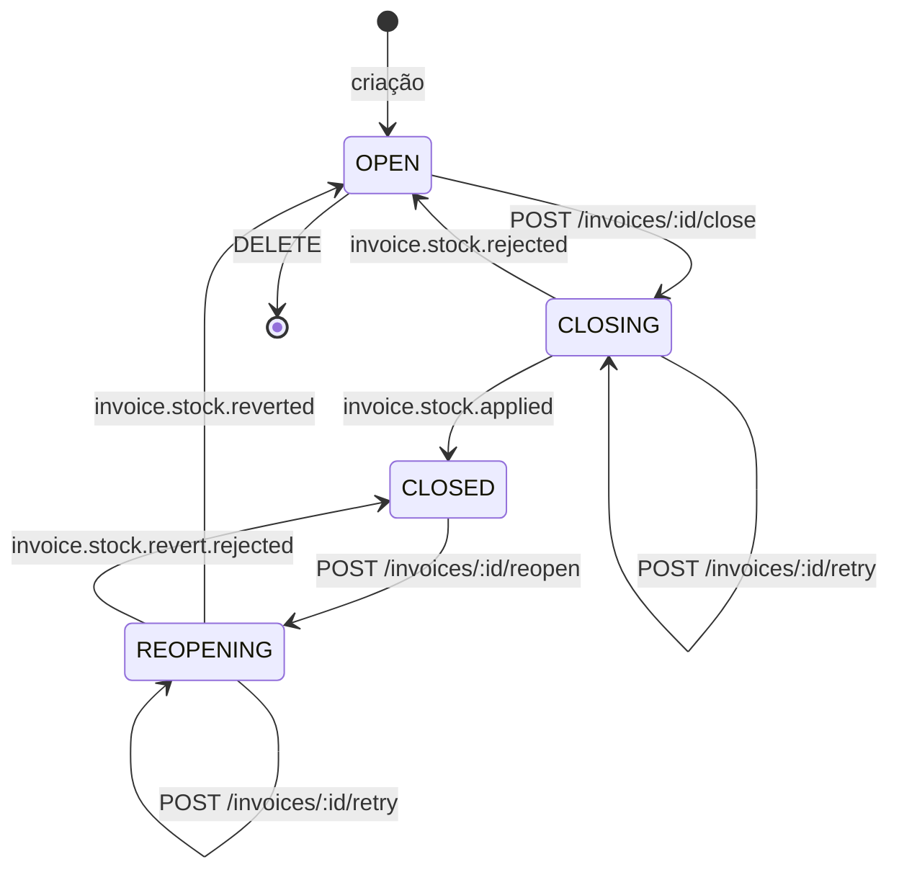
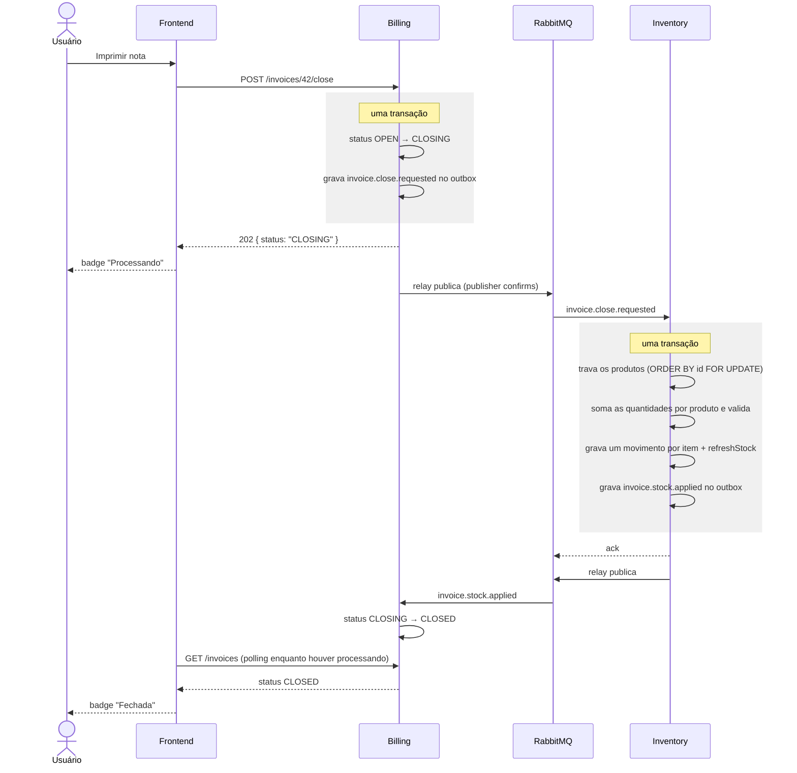
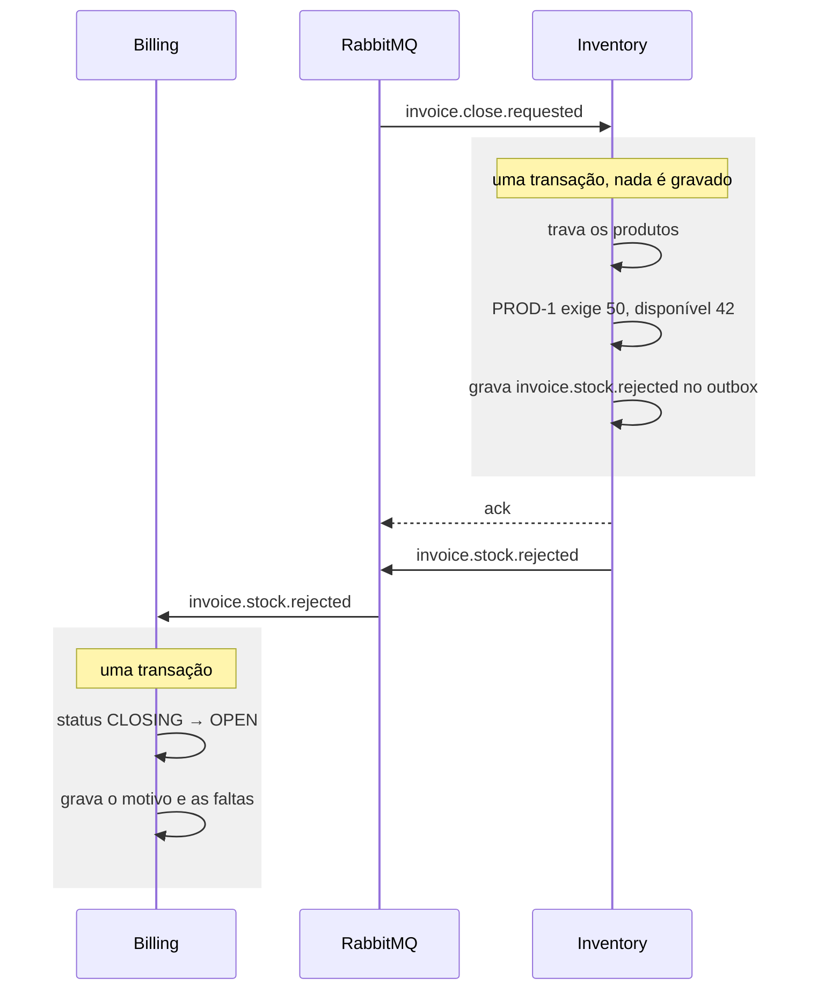

# Arquitetura — integração entre billing e inventory

## Contexto

Dois microsserviços, cada um com seu Postgres, sem acesso ao banco do outro:

- **inventory** — catálogo de produtos e razão de movimentações. O campo
  `product.stock` é saldo cacheado, sempre recalculado a partir dos movimentos
  confirmados.
- **billing** — notas fiscais e seus itens, mais uma réplica local do catálogo
  de produtos.

Este documento descreve como os dois conversam e por quê. Ele reflete o que
está implementado; o que ainda não está tem seção própria no fim.

## Decisão: comunicação assíncrona por eventos

O fechamento de uma nota envolve dois bancos, então não existe transação que
cubra os dois lados. As opções avaliadas:

| Opção | Por que não |
|---|---|
| Billing escreve no banco do inventory | Quebra o isolamento; o inventory deixa de ser dono das próprias regras |
| Billing consulta o saldo e depois grava o movimento | Duas chamadas abrem janela de corrida: duas notas concorrentes passam nas duas validações e o saldo fica negativo |
| Chamada HTTP síncrona no fechamento | Funciona, mas o fechamento passa a exigir o inventory no ar naquele instante |
| **Eventos, com saga coreografada** | **Escolhida** |

Dois motivos:

1. **Disponibilidade.** Com o inventory fora do ar dá para criar, editar e
   imprimir notas. A requisição espera na fila e é processada quando ele volta.
2. **Feedback explícito.** A nota ganha estados de processamento visíveis na
   tela. O assincronismo deixa de ser efeito colateral escondido e vira parte
   do contrato da interface.

O custo é consistência eventual: existe um intervalo — normalmente de
milissegundos — em que a nota saiu de `OPEN` e ainda não chegou em `CLOSED`.
Esse intervalo é representado no modelo, bloqueia edição e exclusão, e aparece
para o usuário.

**A validação de saldo não acontece no billing.** É regra do inventory e roda
na mesma transação que grava os movimentos, sob lock das linhas de produto.
Verificar em um serviço e gravar em outro é a corrida descrita na tabela acima.

## Os dois fluxos

A integração tem duas naturezas diferentes, e cada uma usa o mecanismo que lhe
cabe:

**Movimentação de estoque** (billing → inventory → billing) é uma conversa com
resposta: o billing pede, o inventory decide, o billing reage. É uma saga
coreografada com compensação.

**Sincronização de catálogo** (inventory → billing) é pub/sub puro: o inventory
publica o que aconteceu com um produto sem saber quem escuta, e não há resposta
de negócio a esperar.

---

# Parte 1 — Movimentação de estoque

## Ciclo de vida da nota fiscal



| Estado | Rótulo na tela | Editar | Excluir | Fechar | Reabrir | Reenviar |
|---|---|:-:|:-:|:-:|:-:|:-:|
| `OPEN` | Aberta | sim | sim | sim | — | — |
| `CLOSING` | Processando | não | não | não | não | sim |
| `CLOSED` | Fechada | não | não | — | sim | — |
| `REOPENING` | Processando | não | não | não | não | sim |

O reenvio não é uma transição: repete o pedido que a nota já fez, mantendo o
status. Está descrito em [Nova tentativa e fila morta](#nova-tentativa-e-fila-morta).

No modelo isso vive em três predicados: `Editable()` (só `OPEN`), `Closed()` e
`Processing()` (`CLOSING` ou `REOPENING`). A reabertura é assíncrona pelo mesmo
motivo do fechamento: **estornar também pode ser recusado**, quando a
mercadoria que entrou pela nota já saiu.

## Fechamento — caminho feliz



## Fechamento — recusa



Saldo insuficiente é **resposta de negócio, não falha de infraestrutura**: a
mensagem recebe ack normal e não vai para retentativa. A compensação da saga é
devolver a nota para `OPEN`.

Como não existe request aberto para responder 409, o motivo **e as faltas** são
persistidos e saem na API. A interface usa os dois em lugares diferentes: a
listagem mostra o resumo ("Estoque insuficiente: PROD-1"), e a tela de edição
mostra o detalhe, porque é onde o usuário corrige.

No formulário, o aviso aparece em dois pontos: um banner no topo e, embaixo do
campo de quantidade, o saldo que havia. O campo **não** recebe o vermelho de
erro de validação: a falta é um retrato do momento do fechamento — outra nota
pode ter consumido ou liberado saldo desde então — e a nota pode ser salva e
impressa normalmente, só pode falhar de novo. É aviso, não impedimento.

Item repetido do mesmo produto recebe o aviso nas duas linhas, porque quem
estourou foi a soma. Qual linha reduzir é decisão do usuário.

## A regra de validação

Três detalhes que decidem a corretude:

**Soma por produto, não por item.** Uma nota pode ter dois itens do mesmo
produto. Comparar item a item deixa 10 e 5 passarem separadamente contra um
saldo de 12, e o estoque fica em −3. A validação agrega antes de comparar:

```go
required := map[int]int{}
for _, item := range request.Items {
    required[item.ProductID] += item.Quantity
}
```

**Lock sempre na mesma ordem.** Os produtos são travados por
`ORDER BY id FOR UPDATE` sobre a lista deduplicada e ordenada. Duas notas que
compartilham produtos adquirem os locks na mesma sequência e não travam uma na
outra. O estorno usa a **mesma ordem** — produtos primeiro, nunca movimentos
primeiro — para não inverter a hierarquia e criar deadlock com o fechamento.

**Tudo ou nada.** Se um item não tem saldo, nenhum movimento é gravado e o
evento de recusa lista todas as faltas de uma vez.

Notas de entrada (`type: "IN"`) somam saldo e não passam por validação.

## Um movimento por item

O movimento é gravado com grão de **item**, não de produto. Dois itens do mesmo
produto geram dois movimentos, e o `refreshStock` soma o razão.

Isso é o que mantém a chave de idempotência única: o índice único em
`billing_invoice_item_id` só funciona porque cada item tem seu movimento.
Consolidar por produto perderia essa chave e a rastreabilidade item a item.

## Reabertura — estorno por exclusão

O estorno **apaga** os movimentos da nota, em vez de gravar lançamentos
compensatórios. A alternativa foi considerada e descartada:

| | Apagar | Compensar |
|---|---|---|
| Refechamento com quantidades novas | funciona: sem movimentos, aplica de novo | quebra: a checagem de replay continua vendo movimentos |
| Histórico | a nota registra a reabertura; o refechamento gera movimentos com `close_event_id` novo | razão completo |

O histórico que interessa não se perde: cada tentativa de fechamento tem seu
`close_event_id` nos movimentos que gerou. Guardar entradas anulando saídas de
uma nota corrigida antes de existir de fato adiciona ruído ao razão.

**A recusa do estorno** acontece quando desfazer deixaria saldo negativo — nota
de entrada cuja mercadoria já saiu. Nesse caso a nota volta para `CLOSED` com
`STOCK_ALREADY_USED`, e nada é apagado.

## Contratos dos eventos

Envelope comum: todo evento carrega `eventId` (UUID próprio) e `occurredAt`.
Os eventos de resultado carregam também `causationId` — o `eventId` da
requisição que os originou.

### billing → inventory (exchange `billing.events`)

**`invoice.close.requested`**

```json
{
  "eventId": "db079328-346e-450f-abb4-2a91a6f6ecbc",
  "occurredAt": "2026-08-23T06:17:09Z",
  "invoiceId": 33,
  "invoiceNumber": "NF-OFFLINE",
  "type": "OUT",
  "items": [
    { "invoiceItemId": 37, "productId": 23, "quantity": 1 }
  ]
}
```

`productId` é o identificador **no inventory**. No banco do billing ele
corresponde a `product.inventory_id`, não a `product.id` — a réplica tem chave
própria. Confundir os dois é o erro mais provável nessa integração.

**`invoice.reopen.requested`**

```json
{
  "eventId": "8ef5f2da-…",
  "occurredAt": "2026-08-23T05:56:09Z",
  "invoiceId": 31,
  "invoiceNumber": "001/00006"
}
```

O inventory já conhece os movimentos da nota, então o estorno não repete itens.

### inventory → billing (exchange `inventory.events`)

**`invoice.stock.applied`** e **`invoice.stock.reverted`**

```json
{
  "eventId": "9b7b1b80-…",
  "causationId": "db079328-346e-450f-abb4-2a91a6f6ecbc",
  "occurredAt": "2026-08-23T06:17:19Z",
  "invoiceId": 33
}
```

**`invoice.stock.rejected`** e **`invoice.stock.revert.rejected`**

```json
{
  "eventId": "12f2d9a9-…",
  "causationId": "37a7c84c-…",
  "occurredAt": "2026-08-23T05:55:03Z",
  "invoiceId": 32,
  "reason": "INSUFFICIENT_STOCK",
  "shortages": [
    { "productId": 17, "code": "PRD-0002", "name": "Notebook Dell", "required": 10, "available": 9 }
  ]
}
```

Motivos possíveis: `INSUFFICIENT_STOCK`, `PRODUCT_NOT_FOUND` (produto da nota
não existe mais) e `STOCK_ALREADY_USED` (só no estorno).

## Rastreabilidade: causationId

Cada resultado aponta para a requisição que o causou, e o movimento guarda o
mesmo id em `stock_movement.close_event_id`. Isso distingue **tentativas**: uma
nota recusada, corrigida e refechada tem duas requisições, e só uma gerou os
movimentos que sobreviveram.

Depurar uma nota vira uma sequência sem adivinhação:

```
1. billing    SELECT event_id FROM outbox_event WHERE aggregate_id = 42
                → "A"
2. inventory  SELECT * FROM stock_movement WHERE close_event_id = 'A'
3. inventory  SELECT * FROM outbox_event WHERE causation_id = 'A'
4. logs       grep A nos dois serviços
```

O relay também põe o `causationId` no `correlation_id` da mensagem AMQP, então
a causa aparece na interface do RabbitMQ sem abrir o payload. O `message_id`
carrega o `eventId`.

Não existe `correlationId` separado. Com dois saltos ele seria sempre igual ao
`causationId`; entra quando aparecer um terceiro.

---

# Parte 2 — Sincronização de catálogo

O inventory publica `product.created`, `product.updated` e `product.deleted`.
O billing consome e mantém uma réplica local, que alimenta as telas de nota
fiscal.

```json
{
  "eventId": "f3e2a285-…",
  "occurredAt": "2026-08-23T06:16:53Z",
  "productId": 25,
  "code": "SYNC-1",
  "name": "Produto sincronizado",
  "unit": "UN",
  "price": 9.9
}
```

`product.deleted` carrega só `eventId`, `occurredAt` e `productId`.

**Exclusão desativa, não apaga.** A linha continua ancorando os itens de notas
antigas; o catálogo passa a filtrar por `active`.

**O que não é replicado: `stock`.** Saldo é dado vivo do inventory. Uma cópia
no billing estaria desatualizada por definição e convidaria alguém a validar
saldo localmente, reintroduzindo a corrida que todo este desenho evita.

**O item da nota mantém o próprio snapshot.** `product_code`, `product_name`,
`unit` e `unit_price` são congelados no item. A réplica espelha o catálogo
atual; o item guarda o que foi emitido. Por isso a gravação de itens usa
`ON CONFLICT DO NOTHING` — insere o produto se a sincronização ainda não o
trouxe, mas **nunca sobrescreve** o catálogo.

---

# Parte 3 — Infraestrutura

## Topologia RabbitMQ

```
billing.events (topic, durable)
  ├── invoice.close.requested  ──┐
  └── invoice.reopen.requested ──┴→ inventory.invoice-requests (quorum, durable)

inventory.events (topic, durable)
  ├── invoice.stock.applied         ──┐
  ├── invoice.stock.rejected        ──┤
  ├── invoice.stock.reverted        ──┼→ billing.stock-results (quorum, durable)
  ├── invoice.stock.revert.rejected ──┘
  │
  ├── product.created ──┐
  ├── product.updated ──┼→ billing.catalog (quorum, durable)
  └── product.deleted ──┘

billing.dead-letter (topic, durable)
  └── # ──→ billing.dead-letter (quorum, durable)

inventory.dead-letter (topic, durable)
  └── # ──→ inventory.dead-letter (quorum, durable)
```

Cada serviço tem sua própria fila morta, para onde o broker manda o que o
consumidor recusar. A binding aqui é `#` de propósito: é o único lugar onde
não se sabe de antemão o que vai chegar, e a chave original é preservada no
dead-letter.

**Bindings são explícitas, uma por routing key** — sem curingas. Assim a chave
aparece nas duas pontas para um `grep`, e a fila declara exatamente o que
aceita, em vez de tudo que casar num padrão.

O modo de falha que isso introduz — esquecer uma binding e a mensagem sumir em
silêncio — é coberto pelo `mandatory` na publicação: o broker devolve o que não
roteou, o relay trata como erro e a causa fica gravada em
`outbox_event.last_error`.

Configuração das filas:

- **Filas quorum, duráveis**, com dead-letter exchange configurada.
- **Mensagens persistentes** (`delivery_mode=2`).
- **Publisher confirms**: o relay só marca como publicado depois do ack.
- **Ack manual** com `prefetch=1`.
- **Reconexão com backoff** nos dois lados: nenhum serviço falha ao subir com o
  broker fora do ar, e ambos voltam a publicar e consumir sozinhos quando ele
  retorna.

A topologia é declarada na subida de cada serviço — operações idempotentes que
dispensam script de provisionamento. A ressalva é que **argumento de fila não
se altera por redeclaração**: uma fila que já existe com outros argumentos faz
o broker responder `PRECONDITION_FAILED` e o serviço fica em laço de
reconexão. Ao introduzir a DLX foi preciso apagar as filas antigas com os dois
serviços parados:

```bash
curl -u guest:guest -X DELETE http://localhost:15672/api/queues/%2F/billing.stock-results
curl -u guest:guest -X DELETE http://localhost:15672/api/queues/%2F/billing.catalog
curl -u guest:guest -X DELETE http://localhost:15672/api/queues/%2F/inventory.invoice-requests
```

## Nova tentativa e fila morta

Um handler que devolve erro não diz a mesma coisa em todos os casos. O
consumidor separa dois:

- **Mensagem venenosa** — o corpo não decodifica. Nova entrega nunca vai
  funcionar. Vai para a fila morta na hora, sem espera. É o que o
  `msgerr.Poison` marca, e o único lugar que o marca hoje é o `json.Unmarshal`
  dos handlers.
- **Falha transitória** — banco fora do ar, deadlock, timeout. A mesma
  mensagem tem chance na próxima entrega. Volta para a fila com
  `requeue=true`, depois de uma espera que dobra a cada tentativa (2s, teto de
  30s), até `retryLimit` tentativas; esgotado o orçamento, vai para a fila
  morta.

**O orçamento de tentativas é do consumidor, não do broker.** A intenção
original era usar o `delivery_limit` das filas quorum, mas no RabbitMQ 4.x ele
não conta retorno explícito: `basic.nack` com `requeue=true` incrementa
`x-acquired-count` e deixa `delivery-count` parado — a mensagem volta
indefinidamente e o limite nunca dispara. Está verificado contra o broker real
em `topology_test.go`. O consumidor então lê o `x-acquired-count` da entrega
(ou `x-delivery-count`, em broker mais antigo) e decide ele mesmo quando parar.

O `delivery_limit` continua valendo como rede para o que o consumidor não
controla: entrega perdida por queda de canal ou de conexão.

A espera acontece **dentro do consumidor**, antes de devolver a mensagem. Com
`prefetch=1` isso segura a fila inteira enquanto a tentativa está pendurada —
o que é o comportamento desejado quando a causa é o banco fora do ar, já que a
próxima mensagem falharia igual. O custo é que uma falha específica de uma
mensagem atrasa as de trás; o teto de 30s por tentativa existe para manter
esse atraso limitado, bem abaixo do `consumer_timeout` de 30 minutos do broker.

Nada disso recupera a nota sozinho depois que a mensagem morre — para isso
existe o reenvio.

## Reenvio de nota travada

`POST /invoices/:id/retry` grava no outbox **um novo evento igual ao que a
nota já pediu** — `invoice.close.requested` para `CLOSING`,
`invoice.reopen.requested` para `REOPENING` — sem mexer no status. O resto do
caminho é o normal: relay publica, inventory consome, resultado volta.

Repetir o pedido é seguro porque o inventory é idempotente: `alreadyApplied`
sob lock reconhece a nota já baixada e responde `invoice.stock.applied` de
novo, sem gravar movimento em dobro. O mesmo vale para o estorno, que não acha
mais movimento e responde `invoice.stock.reverted`.

Vale tanto para a mensagem que morreu na DLQ quanto para a que se perdeu por
qualquer outro motivo — o reenvio não precisa saber onde ela parou.

## O que o usuário vê enquanto espera

Oferecer o reenvio desde o primeiro instante seria convidar o usuário a agir
sobre um problema que quase sempre não existe: o caminho feliz leva
milissegundos. Por isso a tela tem três faixas, que espelham o que o sistema
está de fato fazendo por dentro:

| Tempo em processamento | O que acontece por dentro | O que a tela mostra |
|---|---|---|
| até 30s | fluxo normal, ou mensagem esperando na fila | só "Processando" |
| 30s a 5min | o consumidor está retentando, com espera crescente | "Estamos com instabilidade. A nota fiscal continua sendo processada, você não precisa fazer nada." |
| acima de 5min | o orçamento de tentativas acabou, a mensagem foi para a fila morta | "Não foi possível concluir o processamento desta nota fiscal." + **Tentar novamente** |

A faixa do meio é a que justifica o desenho: ali o sistema está trabalhando, e
o botão só produziria um segundo pedido em cima de um que ainda vai dar certo.

O relógio vem da API, no campo `processingSince` da nota, e sai do
`created_at` do **último** evento daquela nota no outbox — não de um
`updated_at` na `invoice`. A diferença aparece no reenvio: ele grava evento
novo sem tocar na linha da nota, então com `updated_at` a mensagem de erro
ficaria congelada na tela depois do clique. Com o outbox, o relógio zera e a
nota volta para "Processando", que é a verdade. A consulta é uma só, agrupada
por `aggregate_id`, e só para as notas em processamento.

O polling da listagem acompanha: 1,5s enquanto alguma nota ainda pode concluir
a qualquer momento, 10s quando todas já passaram do primeiro limiar.

## Outbox transacional

Gravar no Postgres e publicar no RabbitMQ não compartilham transação. Publicar
direto do handler produz dois defeitos simétricos: publicou e o commit falhou,
ou commitou e a publicação falhou.

Por isso **os dois serviços têm outbox**. Se o inventory gravasse os movimentos
e falhasse ao publicar o resultado, a nota ficaria presa em `CLOSING`.

```sql
CREATE TABLE outbox_event (
  id              BIGSERIAL PRIMARY KEY,
  event_id        UUID        NOT NULL UNIQUE,
  causation_id    VARCHAR(36),            -- só no inventory
  aggregate_type  VARCHAR(30) NOT NULL,   -- 'invoice' | 'product'
  aggregate_id    INT         NOT NULL,
  routing_key     VARCHAR(60) NOT NULL,
  payload         JSONB       NOT NULL,
  created_at      TIMESTAMPTZ NOT NULL,
  published_at    TIMESTAMPTZ,
  attempts        INT         NOT NULL DEFAULT 0,
  next_attempt_at TIMESTAMPTZ NOT NULL,
  last_error      TEXT
);
```

### O relay

Uma goroutine com ticker de 1 segundo, que a cada tique reivindica um lote,
publica e marca o resultado.

A reivindicação **não segura o lock durante a publicação**. Manter transação
aberta atravessando I/O de rede prende conexão do pool e estoura em qualquer
lentidão do broker. Em vez disso:

```sql
-- transação curta: seleciona e arrenda
SELECT * FROM outbox_event
WHERE published_at IS NULL AND next_attempt_at <= now()
ORDER BY id
FOR UPDATE SKIP LOCKED
LIMIT 50;

UPDATE outbox_event SET next_attempt_at = now() + interval '30 seconds'
WHERE id IN (...);
```

Publica fora da transação, e só então marca como publicado. Se o processo
morrer no meio, o arrendamento expira e outro relay pega. O `SKIP LOCKED`
permite várias réplicas do mesmo serviço sem lock distribuído.

Falha de publicação incrementa `attempts` e adia com backoff exponencial até
1 minuto.

## Idempotência

O RabbitMQ entrega **ao menos uma vez**. Reentrega acontece sempre que o
consumidor commita e morre antes do ack. Os dois lados toleram a mesma mensagem
duas vezes, com estratégias diferentes:

**No inventory — por existência.** Antes de decidir, o handler verifica se já
existem movimentos com aquele `billing_invoice_id`. Se existem, responde
`applied` de novo sem gravar nada.

O detalhe que decide o comportamento: reentrega precisa **confirmar com sucesso
e republicar o resultado**. Tratar como erro faria a mensagem esgotar as
tentativas justamente no caso em que tudo deu certo, deixando a nota presa.

A verificação de replay vem **antes** da de saldo. Numa reentrega o estoque já
foi baixado, então o saldo atual é o que sobrou depois da baixa; compará-lo de
novo recusaria uma nota que deu certo.

**No billing — por estado.** A transição só se aplica se a nota estiver no
estado de origem esperado:

```sql
UPDATE invoice SET status = 'CLOSED' WHERE id = ? AND status = 'CLOSING'
```

`RowsAffected = 0` significa "alguém já moveu" — mensagem duplicada ou fora de
ordem. Confirma e ignora. Isso também dispensa qualquer garantia de ordenação
na fila.

## Modelo de dados

### billing

O documento é identificado por **série e número**, dois inteiros, e não por uma
string livre:

```sql
ALTER TABLE invoice
  ADD COLUMN series INT NOT NULL,
  ADD COLUMN number INT NOT NULL;
CREATE UNIQUE INDEX idx_invoice_document ON invoice (series, number);
```

Isso vem de um problema concreto: como texto, `001/000057` ordena **antes** de
`001/00006` — a nota 57 aparecendo antes da 6 — e nada impedia dois documentos
com o mesmo número. Com inteiros, `ORDER BY series DESC, number DESC` ordena de verdade — a nota
mais recente no topo —,
a unicidade é do banco, e o formato `001/000057` passa a ser apresentação
(`FormattedNumber()`), não armazenamento.

A listagem de produtos ordena por `code`, pelo mesmo motivo: sem `ORDER BY` o
Postgres devolve a ordem física do heap, e um `UPDATE` joga a linha editada
para o fim — o registro que o usuário acabou de salvar sumia do lugar.

```sql
-- invoice.status: OPEN | CLOSING | CLOSED | REOPENING
ALTER TABLE invoice ADD COLUMN failure_reason VARCHAR(30);
-- processingSince não é coluna: sai do último outbox_event da nota

CREATE TABLE invoice_shortage (
  id           SERIAL PRIMARY KEY,
  invoice_id   INT NOT NULL,
  inventory_id INT NOT NULL,
  product_code VARCHAR(30)  NOT NULL,
  product_name VARCHAR(255) NOT NULL,
  required     INT NOT NULL,
  available    INT NOT NULL
);

-- réplica do catálogo
ALTER TABLE product ADD COLUMN active BOOLEAN NOT NULL DEFAULT true;
```

`failure_reason` e as faltas são apagados no início de cada nova tentativa, na
mesma transação que muda o estado.

A falta é gravada **por produto**, não por item: o que estourou foi a soma, e
dividir os que faltam entre duas linhas seria arbitrário. O casamento com a
linha na tela é por `inventory_id`, que é estável — `invoice_item.id` não é,
porque toda edição apaga e recria os itens.

### inventory

```sql
ALTER TABLE stock_movement
  ADD COLUMN billing_invoice_item_id INT,        -- chave de idempotência (UNIQUE)
  ADD COLUMN billing_invoice_id      INT,        -- indexado
  ADD COLUMN invoice_number          VARCHAR(30),
  ADD COLUMN close_event_id          VARCHAR(36);
```

O prefixo `billing_` marca id de outro serviço. **Não são foreign keys** — id
que atravessa fronteira nunca é. O `invoice_number` é snapshot, para o razão se
ler sozinho sem consultar o billing.

## Camadas

A decisão de negócio vive no **modelo**, como função pura:

```go
func ResolveInvoiceStock(
    request InvoiceStockRequest,
    products map[int]Product,
    alreadyApplied bool,
) (InvoiceStockDecision, error)
```

O repositório faz três passos: **coleta fatos** (trava os produtos, conta os
movimentos existentes), **chama a decisão**, **executa o resultado** (grava os
movimentos, recalcula os saldos, insere o evento).

O sintoma que guia essa separação é onde ficam os testes: precedência de
recusa, agregação e comparação de saldo são testadas sem banco, em
milissegundos. Os testes de repositório cobrem só o que é de infraestrutura —
o lock acontece, a escrita acontece, a reentrega não duplica.

---

# Cenários de indisponibilidade

Todos reproduzíveis no ambiente de desenvolvimento.

### A. Inventory fora do ar

```bash
docker compose stop inventory
```

O billing segue **inteiro**: listar, criar, editar e imprimir notas continuam
funcionando, porque o catálogo vem da réplica local e o fechamento é
assíncrono. As notas ficam em "Processando" e concluem sozinhas quando o
inventory volta. As mensagens esperam na fila durável, observável em
http://localhost:15672.

### B. RabbitMQ fora do ar

```bash
docker compose stop rabbitmq
# fechar uma nota: a API responde 202 normalmente
# SELECT * FROM outbox_event WHERE published_at IS NULL;  → o evento está lá
docker compose start rabbitmq
# o relay drena o outbox e o fluxo se completa
```

É o cenário que o outbox existe para cobrir. Nenhum serviço cai quando o broker
some: a conexão é retentada em segundo plano.

### C. Saldo insuficiente

Falha de negócio. A nota volta para `OPEN`, a interface exibe o motivo, e nada
é gravado no razão. O mesmo vale para o estorno recusado, que devolve a nota
para `CLOSED`.

### D. Resultado tardio ou fora de ordem

Um resultado que chega para uma nota que já saiu do estado de processamento é
reconhecido, confirmado e ignorado — sem mover a nota e sem parar a fila.

### E. Banco fora do ar no meio do fluxo

O caso que a DLX existe para cobrir. O `billing_db` cai na janela em que um
`invoice.stock.applied` chega: o `ConfirmClose` devolve erro, mas o inventory
já gravou os movimentos.

```bash
docker compose stop billing_db
# fechar uma nota: o inventory baixa o estoque e publica o resultado
# o billing loga "message ... returned to billing.stock-results, retrying in 2s"
docker compose start billing_db
# a entrega seguinte passa e a nota vai de CLOSING para CLOSED
```

Do lado do usuário, a nota passa a exibir o aviso de instabilidade enquanto as
tentativas correm.

Se o banco não voltar dentro do orçamento, a mensagem vai para
`billing.dead-letter` — onde dá para vê-la, em vez de sumir — e a nota fica em
`CLOSING`. Aí a tela troca o aviso pela falha e oferece **Tentar novamente**,
que refaz o pedido para o inventory.

### F. Mensagem venenosa

Um corpo que não decodifica vai direto para a fila morta, sem repetir entrega e
sem travar a fila. Nenhuma nota se move; a nota que originou a mensagem fica em
processamento e, passados os limiares, a tela a reporta como não concluída.

---

# O que ainda não está feito

- **Índice parcial no outbox.** A consulta do relay filtra
  `published_at IS NULL`, mas o índice é só em `next_attempt_at` — e todo
  evento já publicado também satisfaz `next_attempt_at <= now()`. Conforme a
  tabela cresce, o índice deixa de filtrar. Correção:
  `CREATE INDEX ... ON outbox_event (id) WHERE published_at IS NULL`.
- **Poda do outbox.** Eventos publicados nunca são apagados.
- **Consumidor da fila morta.** As mensagens ficam em
  `billing.dead-letter` e `inventory.dead-letter` para inspeção, mas nada as
  lê: descobrir que uma nota travou ainda depende de olhar a tela ou o broker.
- **Reenvio em lote.** A ação "tentar novamente" é uma nota por vez.

# Decisões deliberadas de não fazer

- **Reserva de estoque na inclusão do item.** O campo
  `stock_movement.confirmed` permitiria reservar na edição e confirmar no
  fechamento, eliminando a recusa por saldo. O custo é expiração de reserva,
  liberação a cada edição e ida ao inventory a cada alteração. É evolução
  natural, não pré-requisito.
- **Circuit breaker.** Não há chamada síncrona no fluxo crítico; a fila é o
  amortecedor.
- **Orquestrador genérico de saga.** Com dois participantes, a máquina de
  estados da própria nota cumpre o papel.
- **Biblioteca de outbox.** Foram avaliadas o Watermill (com o componente
  Forwarder) e CDC via Debezium. O relay implementado tem ~130 linhas e nenhuma
  dependência nova; o Watermill exigiria adotar suas abstrações de mensageria
  no projeto inteiro, e o CDC, mais um componente para operar. Numa escala
  maior, o CDC seria a escolha certa.
- **Kafka.** Nenhum requisito de reprocessamento histórico, retenção longa ou
  ordenação por partição.
- **Tracing distribuído.** O `causationId` já correlaciona as duas pontas.
